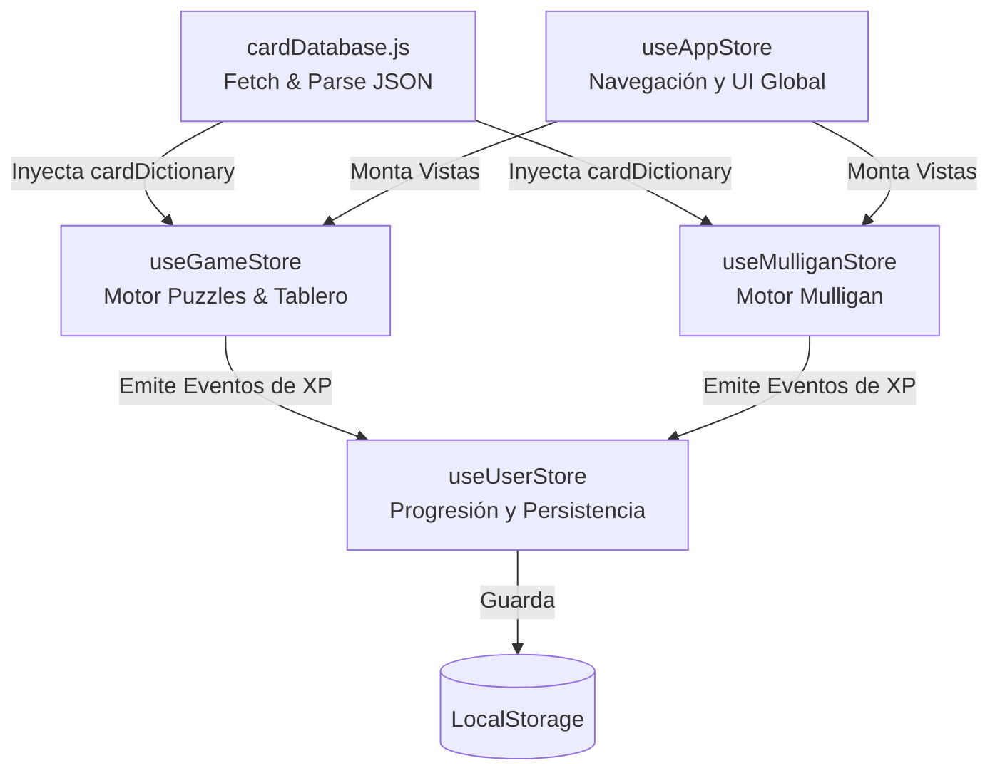

# ⚡ Hearthstone Trainer - Arquitectura y Manual de Operaciones

Este documento define la arquitectura general, el flujo de datos y los procedimientos de mantenimiento del proyecto "Hearthstone Trainer". Ha sido diseñado como la fuente de la verdad para desarrolladores y diseñadores de contenido.

## 1. Resumen Técnico Final

- **Core / UI**: React 19
- **Estilos**: Tailwind CSS v4
- **Gestión de Estado**: Zustand 5
- **Animaciones**: Framer Motion 12
- **Testing**: 56/56 tests ✅ (Cobertura Completa)

## 2. Mapa de Dependencias (Data Flow)

El proyecto utiliza una arquitectura basada en **Zustand** dividida en 4 *stores* principales que separan responsabilidades de forma clara y evitan re-renderizados innecesarios.



### Descripción de los Stores:
1. **`useAppStore` (Navegación / UI)**: Módulo ultra-ligero de enrutamiento estático (SPA sin react-router). Controla la transición de pantallas (Menu, Puzzle, Mulligan, Board Clear) y el modal de dificultad.
2. **`useGameStore` (Motor de Puzzles y Combate)**: El núcleo interactivo. Carga la mesa, controla el maná, resuelve daño/curación, rastrea el historial, aplica auras y verifica la `winConditionType` (`LETHAL` o `BOARD_CLEAR`). 
3. **`useMulliganStore` (Estadísticas y Selección)**: Maneja los escenarios de mano inicial, procesa las decisiones del jugador y las contrasta con el *winrate* proveniente de los datos.
4. **`useUserStore` (Progresión y Persistencia)**: Sistema de experiencia (XP) centralizado. Escucha los casos de éxito de los otros stores (vía `recordPuzzleSolved`, `recordBoardCleared`, `recordMulliganDecision`) y persiste el progreso y las opciones de audio en el navegador.

**Interacción con la BD:** `cardDatabase.js` descarga datos desde la API oficial en `App.jsx`. Una vez parseadas, las cartas forman el `cardDictionary`, inyectado en la memoria global de los motores visuales para inicializar el estado rápidamente y evitar duplicar información en los JSON (Patrón Data-Driven / Flyweight).

---

## 3. Guía de Inserción de Contenido (Para No-Programadores)

Añadir nuevos retos no requiere tocar una sola línea de lógica de React. Todo se configura y añade interactividad directamente desde los archivos JSON en `src/data/`.

### 5 Pasos Simples para añadir un Puzzle:
1. **Abre el archivo** de datos correspondiente (`puzzle1.json` para modo Lethal, o `boardClears.json` para modo Board Clear).
2. **Copia y pega** un objeto de puzzle preexistente para mantener la estructura base y evitar fallos de formato.
3. **Modifica el "playerState"**: Define tu vida (`hp`), `mana`, `heroClass` (importante para el hero power) y las id's oficiales de Hearthstone en la matriz `"hand"`.
4. **Modifica la Mesa**: Coloca esbirros en los arrays `"board"` de `playerState` y `enemyState`. Usa sus IDs reales en `cardRef` para que el motor cargue su imagen automáticamente.
5. **Ajusta la Condición**: Si es un puzle Lethal, define estrictamente la matriz `"solutionSequence"`. Si es Board Clear, la secuencia estricta se ignora y basta con establecer `"winConditionType": "BOARD_CLEAR"`.

### Plantilla de Puzzle Comentada

```json
{
  "puzzleId": "clear_004",
  "title": "Nombre del Nivel",
  "description": "Texto de ambientación o pista estratégica para el jugador.",
  "difficulty": "normal",
  "winConditionType": "BOARD_CLEAR", // O "LETHAL"
  
  "playerState": {
    "hp": 30,
    "mana": { "current": 10, "max": 10 },
    "heroClass": "MAGE",
    "hand": [
      "CS2_029", // cardId exacto de HearthstoneJSON (Ej. Fireball)
      "CS2_022"
    ],
    "board": [
      {
        "id": "min_unico_1", // Un ID inventado obligatoriamente único para clickear
        "cardRef": "EX1_012", // Referencia visual de la carta real
        "name": "Bloodmage Thalnos",
        "attack": 1,
        "health": 1,
        "spellDamage": 1, 
        "canAttack": true, // Permite que actúe en el mismo instante
        "type": "minion",
        "image": "URL_A_LA_IMAGEN_DEL_RECURSO"
      }
    ]
  },
  
  "enemyState": {
    "hp": 30,
    "board": [
      // ... Esbirros enemigos con la misma estructura ...
    ]
  },

  // Solo obligatorio si winConditionType es "LETHAL"
  "solutionSequence": [
    {
      "action": "play_spell", // Acciones válidas: 'play_spell', 'play_minion', 'attack', 'use_hero_power', 'hero_attack'
      "cardId": "CS2_029",    // Carta que disparará la acción (id de HearthstoneJSON)
      "targetId": "min_enemigo_1" // Objetivo (usa el 'id' inventado que le diste a ese esbirro, o "enemy_hero" / "player_hero")
    }
  ]
}
```
*💡 **Mecánicas avanzadas**: Si tu esbirro entra haciendo daño, debes añadir `"battlecry": true` y configurar su efecto `"battlecryConfig": { "type": "TARGETED_DAMAGE", "amount": 2 }` en ese esbirro del array.*

---

## 4. Checklist de Despliegue (GitHub Pages)

Dado que la aplicación es una *Single Page Application* sin backend asíncrono, su entorno ideal y altamente pre-cacheable es GitHub Pages. Vite hace que este proceso sea muy rápido.

**[CRÍTICO] Configuración previa del `base` en Vite:**
Antes de construir la versión de producción, debes decirle a Vite en qué subdirectorio vivirá la app en los servidores de GitHub Pages. 
1. Abre `vite.config.js`.
2. Verifica que el campo `base` coincide EXACTAMENTE con el nombre del repositorio. 
   Por ejemplo, si tu repo es `https://github.com/tuUsuario/hearthstone-trainer`:
   ```javascript
   export default defineConfig({
     plugins: [react()],
     base: '/hearthstone-trainer/', // <-- DEBE LLEVAR LA BARRA AL PRINCIPIO Y AL FINAL
   })
   ```

### Pasos exactos de Rollout:
1. **Construye la App**:
   Ejecuta en tu terminal el empaquetador para compilar la versión optimizada y minificada:
   ```bash
   npm run build
   ```
2. **Revisa la carpeta generada**:
   Se creará una carpeta llamada `/dist`. Todo el código HTML, JS y assets estáticos listos para producción estarán ahí dentro. No debes modificar su contenido a mano.
3. **Publica en Pages**:
   Sube la aplicación utilizando el paquete dedicado a GitHub pages (asegúrate de que todo el repositorio ya ha sido *pusheado* a origin):
   ```bash
   npx gh-pages -d dist
   ```
4. En GitHub, viaja a la pestaña **Settings > Pages** de tu repositorio y asegúrate de que esté configurado para enviar la rama construida (`gh-pages`) en la raíz. Tu web aparecerá online en cuestión de segundos.

---
🌟 *"May your plays be precise, your RNG be blessed, and the lethal always exact."*
